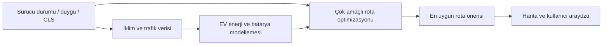

# RoutingPlanning

<p align="center">
  
  
  
  
</p>

Bu depo, elektrikli araç (EV) rota planlamasında sürücü bilişsel yükü, yorgunluk, duygu durumu ve enerji verimliliğini birlikte dikkate alan bir araştırma / prototip altyapısını içerir. Proje, "DynamAffect" yaklaşımıyla sürücü durumunu rota seçim sürecine entegre etmeyi hedefler; ayrıca Ankara için harita tabanlı benzetim ve görsel arayüz desteği sunar.

## Özellikler

- EV rota optimizasyonu ve yol seçimi
- Sürücü bilişsel yükü (CLS) ve yorgunluk modelleri
- Duygu/ifade analizi tabanlı durum tahmini
- Enerji tüketimi, batarya SoC ve şarj planlaması
- Çok amaçlı karar mekanizması (verimlilik, denge, konfor)
- OSM/harita tabanlı görselleştirme
- Streamlit ve web arayüzleri
- Araştırma deneyleri ve karşılaştırma tabloları

## Proje yapısı

```text
RoutingPlanning/
├── app.py                         # Ana Streamlit arayüzü
├── ev_rota_planner.py             # EV rota planlayıcı / harita arayüzü
├── dynamaffect_core.py            # CLS / Affect state modelleri
├── dynamaffect_integration.py     # Rota ve model entegrasyonu
├── dynamaffect_nsga2.py           # Çok amaçlı optimizasyon
├── dynamaffect_qlearning.py       # Öğrenme tabanlı karar mekanizması
├── emotion_engine.py              # Duygu / yüz analizi motoru
├── requirements.txt              # Ana proje bağımlılıkları
├── affectev_v2/                  # Bildiri / araştırma sürümü
│   ├── README.md
│   ├── run.py
│   ├── backend/
│   ├── frontend/
│   ├── experiments/
│   └── results/
├── cache/
├── modeller/
├── veri/
├── driver_q_networks/
├── *.md                          # deney raporları, karşılaştırmalar
├── *.py                          # deney ve analiz scriptleri
└── .github/
```

## Teknoloji yığını

- Python
- Streamlit
- OpenCV
- NumPy / scikit-learn
- Folium
- FastAPI / Uvicorn
- Joblib
- Q-Learning ve çok amaçlı optimizasyon mantığı
- OpenStreetMap / harita verisi

## Ana akış



## Kurulum

### 1) Sanal ortam oluşturma

```bash
python -m venv .venv
```

Windows için:

```powershell
.venv\Scripts\activate
```

Linux/macOS için:

```bash
source .venv/bin/activate
```

### 2) Bağımlılıkları yükleme

```bash
pip install -r requirements.txt
```

### 3) Çalıştırma

Ana arayüz:

```bash
streamlit run app.py
```

Alternatif olarak doğrudan:

```bash
python app.py
```

Araştırma sürümü (daha kapsamlı deneysel arayüz):

```bash
cd affectev_v2
pip install -r requirements.txt
python run.py
```

Tarayıcıda aşağıdaki adresleri kullanabilirsiniz:

- Ana arayüz: `http://localhost:8501`
- AffectEV v2 arayüzü: `http://127.0.0.1:8000`

## Kullanım örneği

1. Başlangıç ve hedef konum seçimi
2. Sürücü durumunun değerlendirilmesi
3. Trafik, hava durumu ve enerji koşullarının tanımlanması
4. Çok amaçlı rota optimizasyonu çalıştırma
5. En uygun güzergâhı seçme ve sonuçları inceleme

## Araştırma odak alanları

Bu proje, aşağıdaki araştırma sorularını ele alır:

- Sürücü bilişsel yükü yüksek olduğunda rota seçimi nasıl değiştirilmelidir?
- Duygusal ve fiziksel yorgunluk, EV enerji verimliliğini nasıl etkiler?
- Çok amaçlı optimizasyon, konfor ile enerji tasarrufu arasında hangi dengeyi sağlar?
- Q-Learning tabanlı karar destek sistemi, kullanıcı tercihleriyle nasıl uyum sağlar?

## Temel dosyalar

- `app.py` — kullanıcı arayüzü ve ana akış
- `dynamaffect_core.py` — CLS, EV, yorgunluk, ASI gibi temel hesaplamalar
- `dynamaffect_integration.py` — model ve planlayıcı entegrasyonu
- `dynamaffect_nsga2.py` — Pareto tabanlı çok amaçlı optimizasyon
- `dynamaffect_qlearning.py` — öğrenme odaklı karar verme
- `emotion_engine.py` — yüz ve duygu analizi
- `affectev_v2/README.md` — daha detaylı akademik açıklama ve deney iş akışı

## Notlar

- Bu proje araştırma odaklı bir prototiptir.
- Bazı modüller deneysel veriler veya yerel model dosyaları gerektirebilir.
- Görseller ve harita çıktıları yerel olarak üretilir.
- `affectev_v2` klasörü, akademik bildiriden türetilmiş daha yapılandırılmış bir uygulama örneği sunar.

## Katkı

Katkı ve geliştirme önerileri hoş karşılanır. Lütfen önce mevcut kod yapısını inceleyip PR üzerinde net bir açıklama ekleyin.

## Lisans

Bu proje, mevcut repo bağlamında araştırma ve prototip kullanımına yöneliktir. Lütfen dağıtım ve kullanım kararını proje sahipliği doğrultusunda yönetin.

## İletişim

İletişim ve iş birliği için proje sahibiyle ilgili repo bilgilerini kullanabilirsiniz.
