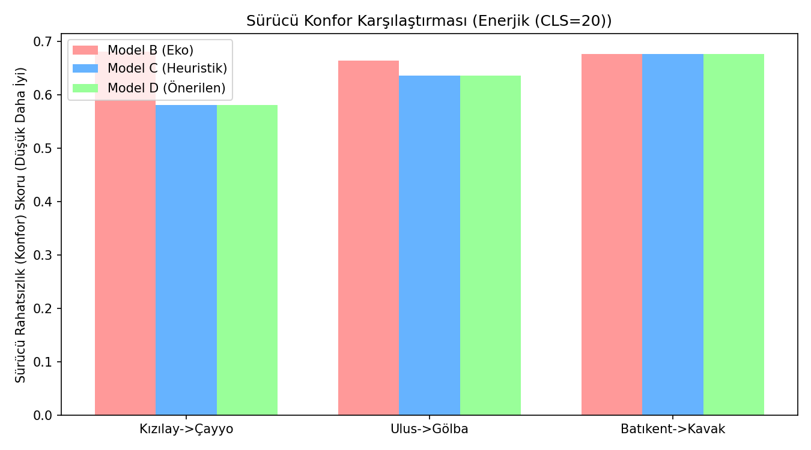
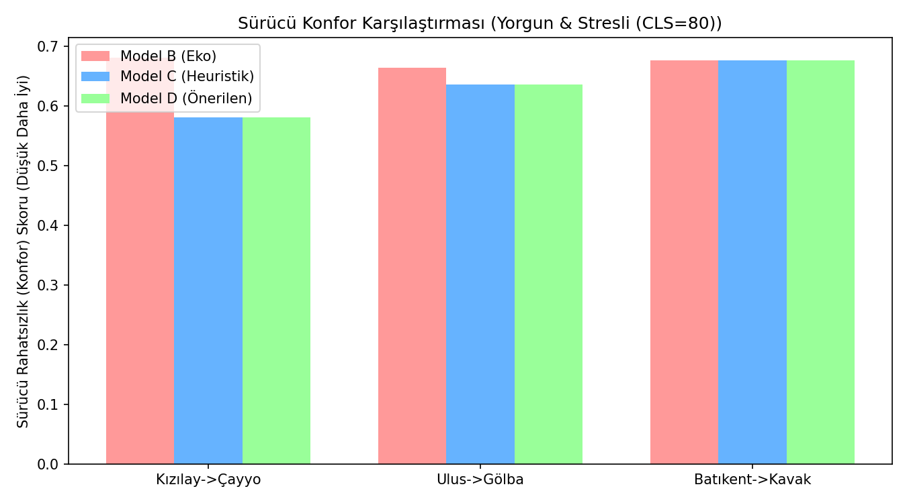

# Otonom Duygu Destekli EV Rota Optimizasyonu — Deneysel Karşılaştırma

Bu belge literatürdeki mevcut algoritmalar ile **Önerilen Tam Pipeline (ML_CLS + Sürekli Duygu Optimizasyonu)** sisteminin Ablation Study (Kısımlama) analizini içerir.

## Modeller
- **Model A (Baseline-Mesafe)**: En kısa mesafeye odaklanan standart Dijkstra.
- **Model B (Baseline-Enerji)**: Sadece enerji verimliliğini (kWh) dert eden Eko Dijkstra.
- **Model C (Kısmi-Heuristik CLS)**: Önceki sistem, İkili/Heuristik Mod ağırlıklarıyla Çok Amaçlı (MO) Rotalama.
- **Model D (Önerilen-Tam Pipeline)**: ML destekli CLS tahmini ve 4-Boyutlu Duygu Regresyonu karışımına dayalı tam optimize Çok Amaçlı Rotalama.

## Enerjik (CLS=20) Durumu Analizi

### Güzergah: Kızılay -> Çayyolu (Şehir İçi Orta Mesafe)
- Duygu Karışımı (ML modeli öngörüsü): Yorgunluk: `0.25`, Stres: `0.25`, Sakinlik: `0.25`, Enerji: `0.25`
| Modeller | Mesafe(km) | Süre(dk) | Enerji(kWh) | Konfor (↓) | Genel F_Skoru (↓) |
|----------|------------|----------|-------------|------------|-------------------|
| Model A (Baseline-Mesafe) | 19.0 | 25.3 | 4.370 | 0.680 | 0.3225 |
| Model B (Baseline-Enerji) | 19.0 | 25.3 | 4.370 | 0.680 | 0.3225 |
| Model C (Kısmi CLS, Heuristik) | 20.0 | 24.0 | 4.559 | 0.581 | 0.2938 |
| **Model D (Önerilen Pipeline)** | 20.0 | 24.0 | 4.559 | 0.581 | 0.2938 |

### Güzergah: Ulus -> Gölbaşı (Çevre Yolu Karma)
- Duygu Karışımı (ML modeli öngörüsü): Yorgunluk: `0.25`, Stres: `0.25`, Sakinlik: `0.25`, Enerji: `0.25`
| Modeller | Mesafe(km) | Süre(dk) | Enerji(kWh) | Konfor (↓) | Genel F_Skoru (↓) |
|----------|------------|----------|-------------|------------|-------------------|
| Model A (Baseline-Mesafe) | 33.0 | 35.0 | 7.143 | 0.635 | 0.3745 |
| Model B (Baseline-Enerji) | 33.0 | 35.0 | 7.143 | 0.664 | 0.3831 |
| Model C (Kısmi CLS, Heuristik) | 33.0 | 35.0 | 7.143 | 0.635 | 0.3745 |
| **Model D (Önerilen Pipeline)** | 33.0 | 35.0 | 7.143 | 0.635 | 0.3745 |

### Güzergah: Batıkent -> Kavaklıdere (Bulvar ve Şehir Merkezine Giriş)
- Duygu Karışımı (ML modeli öngörüsü): Yorgunluk: `0.25`, Stres: `0.25`, Sakinlik: `0.25`, Enerji: `0.25`
| Modeller | Mesafe(km) | Süre(dk) | Enerji(kWh) | Konfor (↓) | Genel F_Skoru (↓) |
|----------|------------|----------|-------------|------------|-------------------|
| Model A (Baseline-Mesafe) | 20.0 | 26.5 | 4.319 | 0.677 | 0.3228 |
| Model B (Baseline-Enerji) | 20.0 | 26.5 | 4.319 | 0.677 | 0.3228 |
| Model C (Kısmi CLS, Heuristik) | 20.0 | 26.5 | 4.319 | 0.677 | 0.3228 |
| **Model D (Önerilen Pipeline)** | 20.0 | 26.5 | 4.319 | 0.677 | 0.3228 |

## Nötr (CLS=45) Durumu Analizi

### Güzergah: Kızılay -> Çayyolu (Şehir İçi Orta Mesafe)
- Duygu Karışımı (ML modeli öngörüsü): Yorgunluk: `0.25`, Stres: `0.25`, Sakinlik: `0.25`, Enerji: `0.25`
| Modeller | Mesafe(km) | Süre(dk) | Enerji(kWh) | Konfor (↓) | Genel F_Skoru (↓) |
|----------|------------|----------|-------------|------------|-------------------|
| Model A (Baseline-Mesafe) | 19.0 | 25.3 | 4.370 | 0.680 | 0.3232 |
| Model B (Baseline-Enerji) | 19.0 | 25.3 | 4.370 | 0.680 | 0.3232 |
| Model C (Kısmi CLS, Heuristik) | 20.0 | 24.0 | 4.559 | 0.581 | 0.2944 |
| **Model D (Önerilen Pipeline)** | 20.0 | 24.0 | 4.559 | 0.581 | 0.2944 |

### Güzergah: Ulus -> Gölbaşı (Çevre Yolu Karma)
- Duygu Karışımı (ML modeli öngörüsü): Yorgunluk: `0.25`, Stres: `0.25`, Sakinlik: `0.25`, Enerji: `0.25`
| Modeller | Mesafe(km) | Süre(dk) | Enerji(kWh) | Konfor (↓) | Genel F_Skoru (↓) |
|----------|------------|----------|-------------|------------|-------------------|
| Model A (Baseline-Mesafe) | 33.0 | 35.0 | 7.143 | 0.635 | 0.3751 |
| Model B (Baseline-Enerji) | 33.0 | 35.0 | 7.143 | 0.664 | 0.3837 |
| Model C (Kısmi CLS, Heuristik) | 33.0 | 35.0 | 7.143 | 0.635 | 0.3751 |
| **Model D (Önerilen Pipeline)** | 33.0 | 35.0 | 7.143 | 0.635 | 0.3751 |

### Güzergah: Batıkent -> Kavaklıdere (Bulvar ve Şehir Merkezine Giriş)
- Duygu Karışımı (ML modeli öngörüsü): Yorgunluk: `0.25`, Stres: `0.25`, Sakinlik: `0.25`, Enerji: `0.25`
| Modeller | Mesafe(km) | Süre(dk) | Enerji(kWh) | Konfor (↓) | Genel F_Skoru (↓) |
|----------|------------|----------|-------------|------------|-------------------|
| Model A (Baseline-Mesafe) | 20.0 | 26.5 | 4.319 | 0.677 | 0.3235 |
| Model B (Baseline-Enerji) | 20.0 | 26.5 | 4.319 | 0.677 | 0.3235 |
| Model C (Kısmi CLS, Heuristik) | 20.0 | 26.5 | 4.319 | 0.677 | 0.3235 |
| **Model D (Önerilen Pipeline)** | 20.0 | 26.5 | 4.319 | 0.677 | 0.3235 |

## Yorgun & Stresli (CLS=80) Durumu Analizi

### Güzergah: Kızılay -> Çayyolu (Şehir İçi Orta Mesafe)
- Duygu Karışımı (ML modeli öngörüsü): Yorgunluk: `0.25`, Stres: `0.25`, Sakinlik: `0.25`, Enerji: `0.25`
| Modeller | Mesafe(km) | Süre(dk) | Enerji(kWh) | Konfor (↓) | Genel F_Skoru (↓) |
|----------|------------|----------|-------------|------------|-------------------|
| Model A (Baseline-Mesafe) | 19.0 | 25.3 | 4.370 | 0.680 | 0.3232 |
| Model B (Baseline-Enerji) | 19.0 | 25.3 | 4.370 | 0.680 | 0.3232 |
| Model C (Kısmi CLS, Heuristik) | 20.0 | 24.0 | 4.559 | 0.581 | 0.2944 |
| **Model D (Önerilen Pipeline)** | 20.0 | 24.0 | 4.559 | 0.581 | 0.2944 |

### Güzergah: Ulus -> Gölbaşı (Çevre Yolu Karma)
- Duygu Karışımı (ML modeli öngörüsü): Yorgunluk: `0.25`, Stres: `0.25`, Sakinlik: `0.25`, Enerji: `0.25`
| Modeller | Mesafe(km) | Süre(dk) | Enerji(kWh) | Konfor (↓) | Genel F_Skoru (↓) |
|----------|------------|----------|-------------|------------|-------------------|
| Model A (Baseline-Mesafe) | 33.0 | 35.0 | 7.143 | 0.635 | 0.3751 |
| Model B (Baseline-Enerji) | 33.0 | 35.0 | 7.143 | 0.664 | 0.3836 |
| Model C (Kısmi CLS, Heuristik) | 33.0 | 35.0 | 7.143 | 0.635 | 0.3751 |
| **Model D (Önerilen Pipeline)** | 33.0 | 35.0 | 7.143 | 0.635 | 0.3751 |

### Güzergah: Batıkent -> Kavaklıdere (Bulvar ve Şehir Merkezine Giriş)
- Duygu Karışımı (ML modeli öngörüsü): Yorgunluk: `0.25`, Stres: `0.25`, Sakinlik: `0.25`, Enerji: `0.25`
| Modeller | Mesafe(km) | Süre(dk) | Enerji(kWh) | Konfor (↓) | Genel F_Skoru (↓) |
|----------|------------|----------|-------------|------------|-------------------|
| Model A (Baseline-Mesafe) | 20.0 | 26.5 | 4.319 | 0.677 | 0.3235 |
| Model B (Baseline-Enerji) | 20.0 | 26.5 | 4.319 | 0.677 | 0.3235 |
| Model C (Kısmi CLS, Heuristik) | 20.0 | 26.5 | 4.319 | 0.677 | 0.3235 |
| **Model D (Önerilen Pipeline)** | 20.0 | 26.5 | 4.319 | 0.677 | 0.3235 |

